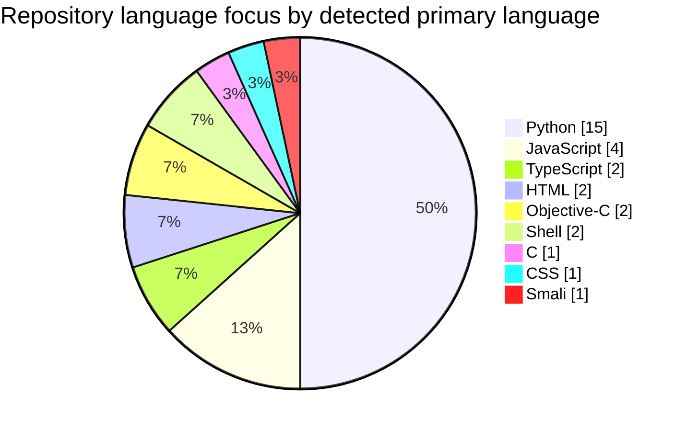

<div align="center">

# Hey, I'm YB 👋

### Taiwan-based builder focused on automation, tooling, and practical experiments.

I like turning repetitive workflows into small, reliable systems.  
Most of my work sits around **Python automation**, **web utilities**, **mobile/runtime tooling**, and **AI-assisted development**.

Currently building and experimenting across public projects and private prototypes.

**Open to sharing ideas, improving tools, and collaborating on interesting side projects.**

</div>

---

## Snapshot



| Metric | Value |
|---|---:|
| Accessible repositories | 33 |
| Original projects | 28 |
| Public repositories | 7 |
| Private prototypes / tools | 26 |
| Repositories updated in 2026 | 22 |
| Updated in the last 90 days | 17 |

> Private repositories are represented only as anonymized aggregate counts. No private repository names, links, descriptions, or internal details are shown here. Language charts use GitHub-detected primary languages and exclude repositories without a detected language.

## Main Stack

<p align="center">
  
  
  
  
</p>

```text
Python       ███████████████  15
JavaScript   ████             4
TypeScript   ██               2
HTML         ██               2
Objective-C  ██               2
Shell        ██               2
C            █                1
CSS          █                1
Smali        █                1
```

## What I Build

- Automation scripts that remove repetitive manual steps.
- Monitoring bots, notification workflows, and small web utilities.
- Mobile/runtime experiments across Python, C, Objective-C, and Smali.
- AI-assisted workflows for testing ideas quickly and shipping useful tools.

## Public Work

- [DC GIF Compressor](https://github.com/TW-3ho/DC_gif_compressor) - Discord GIF compression utility.
- [PTTAutoSign](https://github.com/TW-3ho/PTTAutoSign) - PTT auto sign-in workflow.
- [Azurlane-Build](https://github.com/TW-3ho/Azurlane-Build) - Azurlane regional build and release fork.
- [Zygisk-Il2CppDumper](https://github.com/TW-3ho/Zygisk-Il2CppDumper) - runtime il2cpp dumping tool fork.

## Contact

<p align="center">
  <a href="https://github.com/TW-3ho">
    
  </a>
</p>

---

Last updated: 2026-07-05


